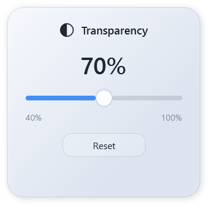
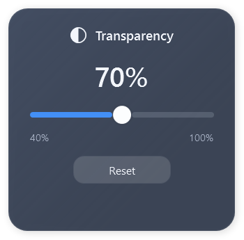

# ◐ WindowOpacity — Window Transparency / Pencere Şeffaflığı

| English | Türkçe |
| --- | --- |
| **A small Windows desktop utility that lets you see through supported application windows.** Click the ◐ button next to Minimize and adjust opacity with a live slider. | **Desteklenen uygulama pencerelerinin arkasını görmenizi sağlayan küçük bir Windows masaüstü aracı.** Küçült düğmesinin yanındaki ◐ simgesine tıklayın ve opaklığı canlı slider ile ayarlayın. |
| Windows 10/11, x64 · C# / .NET 8 · WPF + Win32 | Windows 10/11, x64 · C# / .NET 8 · WPF + Win32 |
| [**Download the latest standalone EXE**](https://github.com/ktlnblrtlfn/WindowOpacity/releases/latest) | [**Güncel bağımsız EXE dosyasını indir**](https://github.com/ktlnblrtlfn/WindowOpacity/releases/latest) |

## Preview / Görünüm

| Light / Açık | Dark / Koyu |
| :---: | :---: |
|  |  |

## Features / Özellikler

| English | Türkçe |
| --- | --- |
| **One-click control:** a small ◐ icon beside the active window's Minimize button; a larger invisible click area. | **Tek tıkla kontrol:** aktif pencerenin Küçült düğmesinin yanında küçük ◐ simgesi; daha geniş görünmez tıklama alanı. |
| **Live slider:** change opacity continuously; the percentage stays above the slider. | **Canlı slider:** opaklığı anında değiştirin; yüzde değeri slider'ın üzerinde kalır. |
| **Light and dark themes:** rounded panels, soft glass-like surfaces and sharp text. The surface is translucent; it does not blur the desktop behind it. | **Açık ve koyu tema:** yuvarlatılmış paneller, yumuşak cam görünümü ve net yazılar. Yüzey yarı saydamdır; arkasındaki masaüstünü bulanıklaştırmaz. |
| **Remember per application:** optionally keep the opacity you choose. Microsoft Store application rules use a version-independent package identity, so updates do not reset them. | **Uygulama başına hatırlama:** seçtiğiniz opaklığı isteğe bağlı kaydedin. Microsoft Store uygulamalarında sürümden bağımsız paket kimliği kullanılır; güncelleme ayarı sıfırlamaz. |
| **Separate WhatsApp channels:** WhatsApp and WhatsApp Beta keep independent settings. | **Ayrı WhatsApp kanalları:** WhatsApp ve WhatsApp Beta bağımsız ayarlarını korur. |
| **Quick reset:** right-click ◐, use Reset, or press **Ctrl + Alt + Shift + O** for the active window. | **Hızlı sıfırlama:** ◐ simgesine sağ tıklayın, Reset'e basın veya aktif pencere için **Ctrl + Alt + Shift + O** kullanın. |
| **Optional mouse wheel:** change opacity by hovering over the caption icon and scrolling. | **İsteğe bağlı fare tekerleği:** başlık simgesinin üzerine gelip kaydırarak opaklığı değiştirin. |
| **Tray controls:** enable/disable, reset all windows, settings and clean exit. | **Sistem tepsisi kontrolleri:** etkinleştirme, tüm pencereleri sıfırlama, ayarlar ve güvenli çıkış. |
| **Start with Windows:** optional automatic launch when you sign in. | **Windows ile başlatma:** oturum açıldığında isteğe bağlı otomatik çalıştırma. |
| **Exclusions and minimum opacity:** choose which applications to skip and how transparent windows can become. | **Hariç tutma ve minimum opaklık:** atlanacak uygulamaları ve pencerelerin ne kadar şeffaf olabileceğini seçin. |
| **Local only:** no account, analytics or cloud service. Settings and diagnostic logs stay on your PC. | **Yerel çalışma:** hesap, analiz veya bulut servisi yoktur. Ayarlar ve tanılama günlükleri bilgisayarınızda kalır. |
| **External window control:** no DLL injection, code injection or target application file modification. | **Harici pencere kontrolü:** DLL/kod enjeksiyonu veya hedef uygulama dosyalarında değişiklik yapılmaz. |

## Download and run / İndir ve çalıştır

| English | Türkçe |
| --- | --- |
| **1.** Open [Releases](https://github.com/ktlnblrtlfn/WindowOpacity/releases/latest) and download `WindowOpacity.exe`. | **1.** [Releases](https://github.com/ktlnblrtlfn/WindowOpacity/releases/latest) sayfasından `WindowOpacity.exe` dosyasını indirin. |
| **2.** Keep the EXE in a permanent folder and open it. No installer or separate .NET runtime installation is needed. | **2.** EXE'yi kalıcı bir klasöre koyup açın. Kurulum programı veya ayrıca .NET kurulumu gerekmez. |
| **3.** Find WindowOpacity in the notification area; Windows may place it under hidden tray icons. | **3.** WindowOpacity'yi sistem tepsisinde bulun; Windows onu gizli simgeler bölümüne koyabilir. |
| **4.** Activate a supported window, click ◐ and drag the slider. The icon follows the **active** window, rather than appearing on every window at once. | **4.** Desteklenen bir pencereyi aktif edin, ◐ simgesine tıklayıp slider'ı kaydırın. Simge aynı anda tüm pencerelerde görünmez; **aktif** pencereyi takip eder. |
| **5.** Enable **Run at Startup** in the tray menu or Settings to launch at future sign-ins. Keep the EXE at that path. | **5.** Sonraki oturum açılışlarında çalışması için tepsi menüsünden veya ayarlardan **Run at Startup** seçeneğini açın. EXE'yi o konumda tutun. |
| **6.** Use the tray's **Exit** command to close the utility and restore the windows it modified. | **6.** Aracı kapatıp değiştirdiği pencereleri eski hâline getirmek için tepsideki **Exit** komutunu kullanın. |

## Compatibility / Uyumluluk

| English | Türkçe |
| --- | --- |
| Validated on a Windows 11 x64 desktop. Classic Win32 windows and installed Notepad were tested; measured caption adapters were verified with ChatGPT/Codex desktop, Brave, WhatsApp and WhatsApp Beta. | Windows 11 x64 masaüstünde doğrulandı. Klasik Win32 pencereleri ve yüklü Not Defteri test edildi; ölçülen başlık düğmeleriyle ChatGPT/Codex masaüstü, Brave, WhatsApp ve WhatsApp Beta desteği doğrulandı. |
| **Not every application is supported.** Custom title bars without verifiable button positions, protected/elevated windows and renderers that reject external layering may be skipped. Existing transparency owned by another renderer is preserved. | **Her uygulama desteklenmez.** Düğme konumları doğrulanamayan özel başlık çubukları, korumalı/yönetici pencereleri ve harici şeffaflığı reddeden görüntüleyiciler atlanabilir. Başka bir görüntüleyicinin mevcut şeffaflığı korunur. |
| A previous WindowOpacity session's marked transparency can be recovered when the utility starts again. This differs from adopting arbitrary third-party layered windows. | Önceki WindowOpacity oturumunun işaretlediği şeffaflık, araç tekrar başladığında devralınabilir. Başka araçların rastgele şeffaf pencereleri devralınmaz. |
| Windows 10 and a full mixed-DPI/application matrix still require broader testing. UI labels are currently English; this documentation is bilingual. | Windows 10 ile kapsamlı çoklu DPI/uygulama matrisi için ek test gerekir. Arayüz metinleri şu anda İngilizcedir; bu dokümantasyon iki dillidir. |
| Details: [validation record](docs/VALIDATION.md). | Ayrıntılar: [doğrulama kaydı](docs/VALIDATION.md). |

## Build from source / Kaynaktan derle

| English | Türkçe |
| --- | --- |
| Requires Windows and the **.NET 8 SDK**, or Visual Studio 2022 with the .NET desktop workload. No third-party NuGet packages are used. | Windows ve **.NET 8 SDK** veya .NET masaüstü iş yükü yüklü Visual Studio 2022 gerekir. Üçüncü taraf NuGet paketi kullanılmaz. |
| Build the solution, or publish a self-contained Windows x64 EXE using the commands below. | Aşağıdaki komutlarla çözümü derleyin veya .NET çalışma zamanı dâhil Windows x64 EXE üretin. |

```powershell
dotnet build WindowOpacity.sln -c Release
dotnet publish WindowOpacity/WindowOpacity.csproj -c Release -r win-x64 --self-contained true -p:PublishSingleFile=true -p:IncludeNativeLibrariesForSelfExtract=true -p:EnableCompressionInSingleFile=true -o artifacts/WindowOpacity-win-x64
```

| English | Türkçe |
| --- | --- |
| Output: `artifacts/WindowOpacity-win-x64/WindowOpacity.exe`. A framework-dependent build needs the .NET 8 Desktop Runtime and its adjacent files. | Çıktı: `artifacts/WindowOpacity-win-x64/WindowOpacity.exe`. Çalışma zamanı içermeyen derleme, .NET 8 Desktop Runtime ve yanındaki dosyaları gerektirir. |
| Local settings: `%LOCALAPPDATA%\WindowOpacity\settings.json`; logs: the adjacent `Logs` folder. | Yerel ayarlar: `%LOCALAPPDATA%\WindowOpacity\settings.json`; günlükler: yanındaki `Logs` klasörü. |

## Tests / Testler

```powershell
dotnet run --project WindowOpacity.Tests -c Release -- identity
dotnet run --project WindowOpacity.Tests -c Release -- recovery
```

| English | Türkçe |
| --- | --- |
| Identity tests verify update-safe migration and persistence. Recovery tests use an isolated hidden fixture; they do not interact with your application windows. | Kimlik testleri güncellemede ayarların taşınmasını ve korunmasını doğrular. Kurtarma testleri ayrı, gizli bir test penceresi kullanır; uygulama pencerelerinize müdahale etmez. |
| Interactive integration tests and native SDK verification are documented in [VALIDATION.md](docs/VALIDATION.md). | Etkileşimli entegrasyon testleri ve yerel SDK doğrulaması [VALIDATION.md](docs/VALIDATION.md) içinde anlatılır. |

## Project structure / Proje yapısı

| Path | English | Türkçe |
| --- | --- | --- |
| `WindowOpacity/Core` | Tracking, filtering, application identity, caption location and opacity control | Pencere takibi, filtreleme, uygulama kimliği, başlık konumu ve opaklık kontrolü |
| `WindowOpacity/Native` | Win32 declarations and event hooks | Win32 tanımları ve olay kancaları |
| `WindowOpacity/UI` | Shared vector icon, popup, settings and theme styles | Ortak vektör ikon, panel, ayarlar ve tema stilleri |
| `WindowOpacity/Services` | Local settings/logging, tray, startup and hotkey | Yerel ayarlar/günlükler, tepsi, başlangıç ve kısayol |
| `WindowOpacity.Tests` | Native integration and persistence/recovery tests | Yerel entegrasyon ve ayar/kurtarma testleri |

## License / Lisans

| English | Türkçe |
| --- | --- |
| Open source under the [MIT License](LICENSE). | [MIT Lisansı](LICENSE) kapsamında açık kaynak. |
